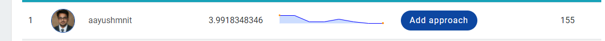

My solution to solve a simple recommendation system challenge on Analytics Vidhya's website - [Jokes Rating Prediction](https://datahack.analyticsvidhya.com/contest/jester-practice-problem/). Here is where I stand with few hours of hacking - 

## About Practice Problem: Is this joke funny?
Many online businesses rely on customer reviews and ratings. Explicit feedback is especially important in the entertainment and ecommerce industry where all customer engagements are impacted by these ratings. Netflix relies on such rating data to power its recommendation engine to provide best movie and TV series recommendations that are personalized and most relevant to the user.

This practice problem challenges the participants to predict the ratings for jokes given by the users provided the ratings provided by the same users for another set of jokes. This dataset is taken from the famous jester online Joke Recommender system dataset.

We thank Dr. Ken Goldberg's group for putting this super cool data together and for permission to share it with the AV community.

## Data
This dataset contains 40,863 users who have rate 139 Jokes b/w -10 to 10 rating. Total ratings databaase contains 1,092,059 observations.

## Approach
Using [fasti collaborative filtering](https://docs.fast.ai/collab.html) to predict jokes ratings based on what other similar users have given to a particular joke. We use collaborative filtering with weight decay to get under 4 RMSE on the test dataset.

## TO-DO:
1) Try a simple classifier approach and see the results
2) Try improving on NN collab learner o/p of FastAI module
3) Try using textual joke features by encoding them using latest Transformer models
4) Ensemble some of these techniques
