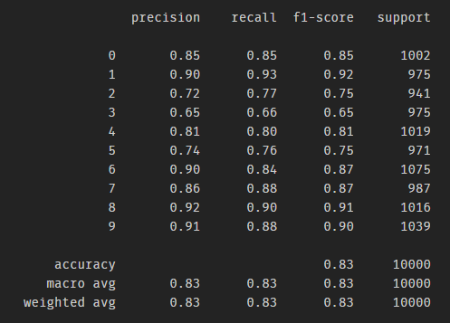

## MiniVGG on CIFAR10 using FastAI2 and Pytorch

In this folder, I have trained a miniature version of VGG architecture using FastAI and Pytorch. To go through the coding process, you can refer to the Jupyter notebook.
