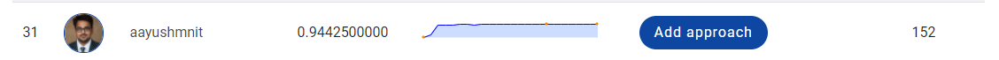

In this folder, I have trained a miniature version of VGG architecture using FastAI2 and Pytorch to solve a simple practice challenge on Analytics Vidhya's website - [Identify the Apparel](https://datahack.analyticsvidhya.com/contest/practice-problem-identify-the-apparels/).

Here is the problem statement - 
We have total 70,000 images (28 x 28), out of which 60,000 are part of train images with the label of the type of apparel (total classes: 10) and rest 10,000 images are unlabelled (known as test images).The task is to identify the type of apparel for all test images. Given below is the code description for each of the apparel class/label.

**Label Description -** 

